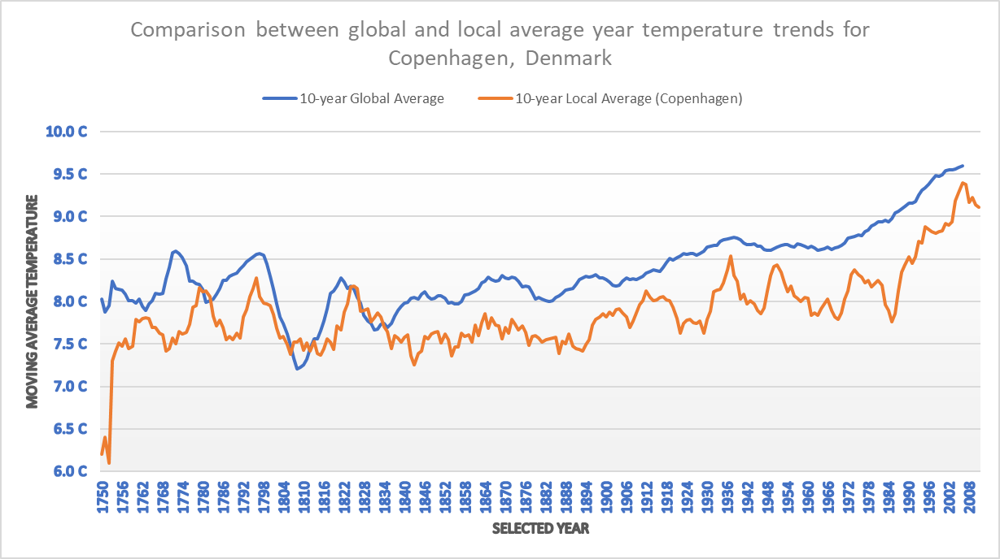

## Project 1: Exploration of weather trends over time: World vs. Denmark

### *by Sebastian Sbirna*

This project demonstrates several found trends in the fluctuations of the average weather temperature of the world in the time interval between the years 1750 to 2013, compared with the local yearly average temperature in Copenhagen, Denmark, where I am currently living in.

Firstly, the data was collected from an online SQL database using the two different commands. The first command, SELECT * from city_data WHERE (country = 'Denmark' OR city = 'Copenhagen'); filters the data from the city_data database to extract only the fields which interest us, namely the ones related to ‘Copenhagen’ or ‘Denmark’. The second command retrieves all the global yearly temperature values from the global_data dataset, using the command SELECT * from global_data; 
 
After these steps, we have obtained two CSV files with the data we need. For each of these data sets (the global, respectively the local data temperature values), we will calculate a moving average over 10 years, in order to smoothen out small abrupt trend changes. The moving average temperature for a year is calculated as taking the sum of the values of average temperature of each of the past 10 years (with the 10th year being included as the current year for which we are calculating the value), after which this sum is divided by the number of years over which we are calculating the average (in this case, 10). 

Figure 1. Line chart graph concomitantly showing global and local temperature moving average trends

After the moving average for all the possible years in both data sets are calculated, we prepare and present a line chart graph (figure 1), which was made to clearly expose trends in the moving average. Since the two data sets have data starting and ending in different years (1750 – 2015 for global_data and 1743 – 2013 for the Copenhagen-filtered values from city_data), we have chosen to intersect these two time-range intervals, in order to be sure to always have data from both sets to compare. 

From this line chart, we can see the following trends and observations:

-   The falling and rising temperature trends in Copenhagen almost always follow closely the trends of the world, with a slight time delay of 4-10 years (*verified by checking the curvatures of the lines throughout the whole time period, however the trends are very visible in: global downfall of 1771, respectively 1780 for Copenhagen; abrupt rise of global temperature around 1808, respectively 1818 for Copenhagen; constant rising since the 1990s, noticed as well in Copenhagen)*. This means that the global weather status greatly impacts Copenhagen's weather temperature as well.

-   Even though the global temperature has continued to steadily increase since 1835, the local temperature has suffered a steady cooling, and in the years 1836-1847, Copenhagen's temperature trend has deviated from the global one, resulting in a difference between the two average temperatures of about 0.5°C ever since 1836, although this gap has been fluctuating over the years, varying from as much as about 1.2°C (in *1985*) to about 0.2°C (in *1937* or *2006*). The creation of this gap between the trends has resulted in Copenhagen not being close to the general average city temperature ever since 1836, however the cause of this gap creation is unknown.

-   It can be noticed from the graph that, with high degree of generality, Copenhagen's weather is colder than the global average. This is because in only very few years has the local weather reached or surpassed the global average, with such exceptions being in the years 1780-1782 and 1825-1834. This results in the assumption that Copenhagen is and has been, for a long time, one of the colder cities of the world.

-   While the global weather trend has been a smooth increase in temperature ever since 1904 (*with some downfall and stagnation between 1942 and 1968*), Copenhagen's average temperature is much more uneven, with constant upturns and downfalls every 10-15 years. This is most likely due to the fact that the global temperature is calculated by taking the average of many major cities around the world, which smoothens out the average data greatly, while Copenhagen's average comes only from one city's data: itself.

There are more observations that could be done from this graph, and the trends presented above have been some of the patterns that could be found from analyzing the moving average value differences between global and local average temperature data.
